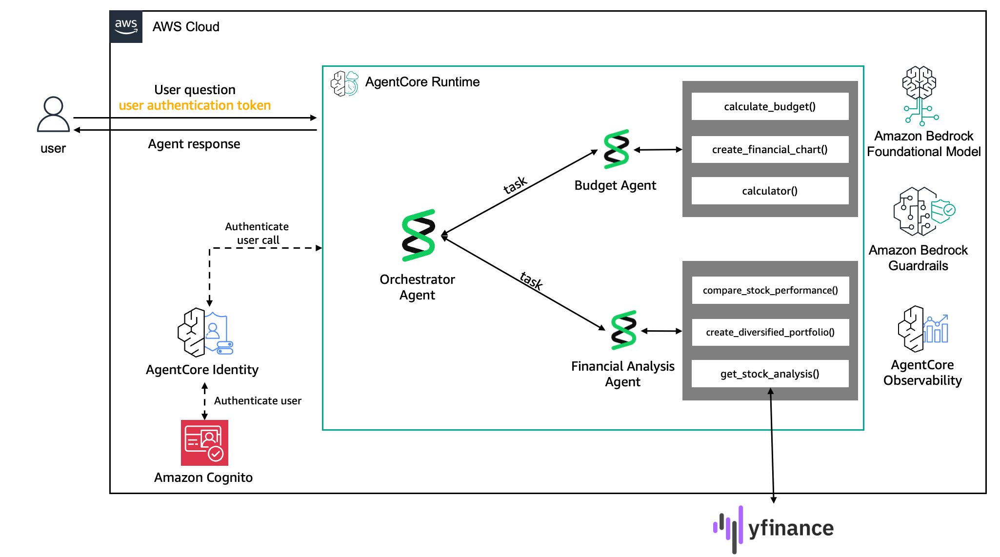

# Finance Personal Assistant

**Multi-agent financial advisory system** built with AWS Bedrock AgentCore and Strands Agents.

This repository contains two implementations designed for different purposes:

## 📂 Repository Structure

```
finance-personal-assistant/
│
├── workshop/          🎓 Workshop materials for learning (1 hour)
│   ├── Jupyter notebooks (Lab 1, 2, 3)
│   ├── Workshop utilities
│   └── Architecture diagrams
│
├── production/        🚀 Production-ready deployment
│   ├── Multi-agent orchestrator
│   ├── Memory strategies
│   ├── Vision & document processing
│   └── CDK infrastructure
│
└── README.md         📖 This file
```

---

## 🎓 Workshop: Learn Multi-Agent Systems (1 Hour)

**Start here if you want to learn** how to build multi-agent systems from scratch.

**Location**: [`workshop/`](./workshop/)

### What You'll Build

A lightweight multi-agent financial advisor with:
- Budget analysis agent
- Investment research agent
- Orchestrator that coordinates both

### Workshop Structure

| Lab | Duration | Focus |
|-----|----------|-------|
| **Lab 1** | 20 min | Build a budget agent with tools and structured outputs |
| **Lab 2** | 20 min | Create multi-agent orchestration |
| **Lab 3** | 15 min | Deploy to AgentCore Runtime with Cognito |

### Getting Started

```bash
cd workshop/
jupyter lab
# Open lab1-develop_a_personal_budget_assistant_strands_agent.ipynb
```

**Full workshop guide**: [workshop/README.md](./workshop/README.md)

---

## 🚀 Production: Enterprise-Grade Deployment

**Use this if you need** a production-ready implementation with advanced features.

**Location**: [`production/`](./production/)

### Features

✅ **Multi-Agent Orchestration** - Specialized agents for budgeting and investments
✅ **AgentCore Memory** - Multi-strategy context retrieval (USER_PREFERENCE, SEMANTIC, SUMMARY)
✅ **Vision Analysis** - Process receipts and invoices with Amazon Nova Premier
✅ **Document Processing** - CSV and PDF parsing with security sanitization
✅ **OAuth2 Authentication** - Production Cognito integration via CDK
✅ **Service Discovery** - SSM Parameter Store for dynamic configuration
✅ **Streaming Responses** - Real-time SSE streaming
✅ **Guardrails** - Content filtering and PII protection

### Quick Start

```bash
cd production/

# Install dependencies
uv sync

# Optional: Deploy OAuth infrastructure
cd cdk && ./deploy.sh && cd ..

# Configure agent
./configure.sh

# Deploy to AWS
./launch.sh

# Verify
./health.sh
```

**Full production guide**: [production/README.md](./production/README.md)

---

## 🔄 Key Differences

| Feature | Workshop | Production |
|---------|----------|------------|
| **Purpose** | Learning & education | Enterprise deployment |
| **Duration** | 1 hour | Production-ready |
| **Memory** | STM only (auto-created) | Multi-strategy (3 strategies) |
| **Authentication** | Basic Cognito | CDK-managed OAuth2 |
| **Vision** | ❌ Not included | ✅ Amazon Nova Premier |
| **Documents** | ❌ Not included | ✅ CSV/PDF processing |
| **Deployment** | Manual (notebooks) | Scripted (configure.sh + launch.sh) |
| **Service Discovery** | Hardcoded ARNs | SSM Parameter Store |
| **UI** | ❌ None | ✅ Streamlit with streaming |
| **Tools** | Basic (calculator, charts) | Advanced (yfinance, browser, memory) |

---

## 🎯 Multi-Agent Architecture

Our system consists of three core components:

### 1. Budget Agent
*Specializes in personal budgeting, spending analysis, and financial discipline*

| Tool | Description |
|------|-------------|
| **calculate_budget_breakdown** | 50/30/20 budget calculations |
| **analyze_spending_pattern** | Spending analysis with recommendations |
| **calculator** | Financial calculations |

### 2. Financial Analysis Agent
*Focuses on investment research, portfolio management, and market analysis*

| Tool | Description |
|------|-------------|
| **get_stock_analysis** | Real-time stock data and analysis |
| **create_diversified_portfolio** | Risk-based portfolio recommendations |
| **compare_stock_performance** | Multi-stock performance comparison |

### 3. Orchestrator Agent
*Coordinates specialized agents and synthesizes comprehensive responses*

| Capability | Description |
|------------|-------------|
| **Agent Routing** | Determines which specialist(s) to consult |
| **Multi-Agent Coordination** | Combines insights from multiple agents |
| **Response Synthesis** | Creates coherent responses |
| **Context Management** | Maintains conversation flow |



---

## 🚦 Which Should I Use?

### Use **Workshop** if you:
- Want to learn multi-agent concepts from scratch
- Are attending or leading a training session
- Need hands-on Jupyter notebook tutorials
- Have 1 hour to build and deploy a working agent

### Use **Production** if you:
- Need a production-ready deployment
- Want advanced features (memory, vision, OAuth)
- Are building an enterprise application
- Need infrastructure-as-code with CDK

### Use **Both** (Recommended):
1. Start with workshop to learn concepts
2. Explore production to see enterprise implementation
3. Use production code as reference for your own projects

---

## 📋 Prerequisites

Both implementations require:

- **Python 3.13+**
- **AWS CLI v2** configured with your own AWS profile
- **Docker** (for production deployments)
- **AWS CDK v2** (for production infrastructure)
- **uv** package manager

### AWS Profile Configuration

**Configure your AWS IAM user credentials** (provided by your workshop administrator):

```bash
# Configure IAM user profile
aws configure --profile workshop

# Enter when prompted:
# - AWS Access Key ID: (provided by administrator)
# - AWS Secret Access Key: (provided by administrator)
# - Default region: us-west-2
# - Output format: json

# Set as default for this session
export AWS_PROFILE=workshop

# Verify credentials
aws sts get-caller-identity
```

**Organizations using AWS SSO:** If your organization requires AWS SSO (IAM Identity Center), see [AWS_SETUP.md - Alternative: AWS SSO](../../AWS_SETUP.md#alternative-aws-sso-for-organizations-with-existing-sso) for configuration details.

**Note:** Throughout this documentation, replace any reference to `AWS_PROFILE=binbash` with your configured profile name. For detailed setup instructions, see [AWS_SETUP.md](../../AWS_SETUP.md).

### Bedrock Model Access (October 2025 Update)

**No manual configuration needed.** As of October 2025, Amazon Bedrock automatically enables all serverless foundation models for every AWS account by default.

**What Changed:**
- All foundation models (Nova, Claude, etc.) are automatically accessible without setup
- The Model Access page and manual enablement process have been deprecated

**For Legacy Accounts Only:**
If you're using an older AWS account that still requires manual enablement:
1. Visit [Bedrock Console](https://console.aws.amazon.com/bedrock/home#/modelaccess)
2. Click "Modify model access"
3. Enable: Amazon Nova (all variants), Anthropic Claude 3.5/4.5
4. Access granted instantly (no approval needed)

**Reference:** [AWS Security Blog - Simplified Model Access](https://aws.amazon.com/blogs/security/simplified-amazon-bedrock-model-access/)

---

## 💡 Sample Queries

### Budget Queries
- "I make $6000/month and want to start investing $500/month. Help me create a budget."
- "I spend too much on dining out ($800/month). How can I cut back?"
- "Create a comprehensive financial report for someone earning $4000/month."

### Investment Queries
- "Analyze Apple stock and tell me if it's a good investment."
- "Create a moderate risk portfolio for $10,000."
- "Compare Tesla, Apple, and Google stocks over the last 6 months."

### Multi-Agent Queries
- "I make $5000/month and want to invest $1000. Help me budget and suggest a portfolio."
- "Analyze my $800 dining expenses, then recommend stocks to invest my savings."

### Vision Queries (Production Only)
- Upload receipt + "Track this expense in my budget."
- Upload invoice + "Add this to my monthly spending analysis."

---

## 🧹 Cleanup

### Workshop Cleanup
```bash
# In Lab 3 notebook, uncomment and run cleanup cells
agentcore_runtime.delete_agent(agent_id=launch_result.agent_id)
delete_cognito_user_pool()
delete_guardrail()
```

### Production Cleanup
```bash
cd production/

# Preview what will be deleted
uv run python cleanup.py --dry-run

# Complete cleanup
uv run python cleanup.py
```

---

## 📚 Resources

- **Workshop Guide**: [workshop/README.md](./workshop/README.md)
- **Production Guide**: [production/README.md](./production/README.md)
- **Workshop Slides**: https://catalog.us-east-1.prod.workshops.aws/workshops/57f577e3-9a24-45e2-9937-e48b2cdf6986/en-US
- **Strands Documentation**: https://strandsagents.com/latest/
- **AgentCore Docs**: https://docs.aws.amazon.com/bedrock-agentcore/
- **AgentCore Toolkit**: https://aws.github.io/bedrock-agentcore-starter-toolkit/

---

## 📄 License & Attribution

Apache License 2.0 - See [LICENSE](../LICENSE) for details.

Based on [Amazon Bedrock AgentCore Samples](https://github.com/awslabs/amazon-bedrock-agentcore-samples) by AWS Labs.

**Original Source**: https://github.com/awslabs/amazon-bedrock-agentcore-samples

This implementation demonstrates multi-agent financial advisory systems using AWS Bedrock AgentCore, adapted for educational purposes and enterprise deployments.
