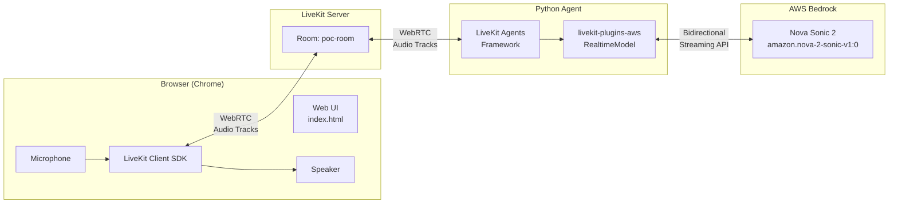
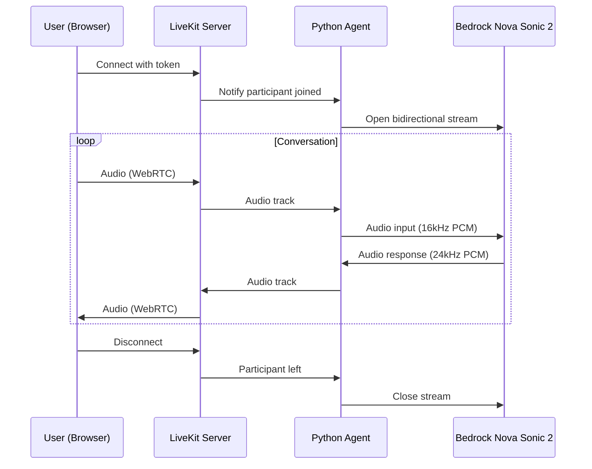

# Nova Sonic 2 POC - WebRTC (LiveKit)

Minimal proof-of-concept for real-time voice interaction with Amazon Nova Sonic 2 using WebRTC via LiveKit.

**Default language:** Brazilian Portuguese (pt-BR) using the Leo native voice.

## Architecture



### Sequence Diagram



## Prerequisites

- Python 3.11+
- AWS credentials with Bedrock access (SSO supported)
- Homebrew (macOS/Linux)
- [just](https://github.com/casey/just) command runner (`brew install just`)
- **Chrome browser** (Firefox/Safari have WebAudio compatibility issues)

## Quick Start

```bash
cd speech-to-speech/amazon-nova-2-sonic/sample-codes/nova-sonic-poc

# Install dependencies (one-time)
just install-livekit
just install
just patch-voices   # Enable native pt-BR voices (leo, carolina)

# Run everything with one command!
just profile=binbash start
```

That's it! The browser will open automatically and connect to Nova Sonic 2.

Press `Ctrl+C` to stop, or run `just stop` from another terminal.

## Manual Setup (3 terminals)

If you prefer the manual approach:

```bash
# Terminal 1: LiveKit Server
just livekit-server

# Terminal 2: Python Agent (with SSO)
just profile=binbash agent-sso

# Terminal 3: Frontend
just token
just frontend
```

Open http://localhost:3000 in Chrome, paste the token, and click "Connect".

## Available Commands

```bash
just --list              # Show all commands

# One-command setup (recommended)
just profile=binbash start   # Start everything, open browser
just stop                    # Stop all processes

# Setup
just check               # Verify prerequisites
just install             # Install Python dependencies
just patch-voices        # Enable native pt-BR voices (leo, carolina)

# AWS SSO
just profile=binbash sso-login    # Login to SSO
just whoami                       # Check AWS identity

# Individual components (for manual setup)
just livekit-server      # Start LiveKit server
just agent-sso           # Run agent with SSO
just token               # Generate LiveKit token
just frontend            # Serve web UI on port 3000
```

## Manual Setup (without just)

### 1. Install LiveKit (one-time)

```bash
brew install livekit livekit-cli
```

### 2. Start LiveKit Server (Terminal 1)

```bash
livekit-server --dev
```

The server will be available at `ws://localhost:7880`.

### 3. Start Python Agent (Terminal 2)

**With AWS SSO:**
```bash
aws sso login --profile binbash
eval $(aws configure export-credentials --profile binbash --format env)
export LIVEKIT_URL=ws://localhost:7880
export LIVEKIT_API_KEY=devkey
export LIVEKIT_API_SECRET=secret
uv run python agent.py dev
```

**With Access Keys:**
```bash
export AWS_ACCESS_KEY_ID=your-key
export AWS_SECRET_ACCESS_KEY=your-secret
export AWS_DEFAULT_REGION=us-east-1
export LIVEKIT_URL=ws://localhost:7880
export LIVEKIT_API_KEY=devkey
export LIVEKIT_API_SECRET=secret
uv run python agent.py dev
```

### 4. Generate Token and Start Frontend (Terminal 3)

```bash
lk token create \
  --api-key devkey --api-secret secret \
  --join --room poc-room --identity user1 \
  --valid-for 24h
```

Copy the token, then:

```bash
cd web && python -m http.server 3000
```

Open http://localhost:3000 in Chrome, paste the token, and click "Connect".

## Project Structure

```
nova-sonic-poc/
├── README.md           # This file
├── justfile            # Task runner (just commands)
├── pyproject.toml      # Python dependencies
├── agent.py            # LiveKit agent (bridges to Nova Sonic 2)
└── web/
    └── index.html      # Vanilla JS frontend (no build step)
```

## Voice Configuration

The agent uses Brazilian Portuguese (pt-BR) by default with the native `leo` voice.

**Native pt-BR voices (after running `just patch-voices`):**

| Voice ID | Gender | Language |
|----------|--------|----------|
| `leo` | Masculine | pt-BR (default) |
| `carolina` | Feminine | pt-BR |

**All available voices:**

| Voice ID | Gender | Languages |
|----------|--------|-----------|
| `leo` | Masculine | Portuguese (Brazil) |
| `carolina` | Feminine | Portuguese (Brazil) |
| `tiffany` | Feminine | English, French, Italian, German, Spanish, Portuguese, Hindi |
| `matthew` | Masculine | English, French, Italian, German, Spanish, Portuguese, Hindi |
| `kiara` | Feminine | Hindi |
| `arjun` | Masculine | Hindi |
| `olivia` | Feminine | English (Australia) |
| `tina` | Feminine | German |
| `amy` | Feminine | English (UK) |
| `lupe` | Feminine | Spanish |
| `carlos` | Masculine | Spanish |
| `ambre` | Feminine | French |
| `florian` | Masculine | French |
| `beatrice` | Feminine | Italian |
| `lorenzo` | Masculine | Italian |
| `greta` | Feminine | German |
| `lennart` | Masculine | German |

> **Note:** Run `just patch-voices` after `just install` to enable the native pt-BR voices (`leo`, `carolina`). This patches the `livekit-plugins-aws` package locally.

To change the voice:

```bash
# Option 1: Environment variable
export VOICE_ID=carolina
just profile=binbash agent-sso

# Option 2: Pass to just commands
just voice=carolina profile=binbash agent-sso
```

## Team Configuration

Each team member can set their default AWS profile:

```bash
# Option 1: Set in shell profile (~/.zshrc or ~/.bashrc)
export AWS_PROFILE=your-profile-name

# Option 2: Pass to just commands
just profile=your-profile-name agent-sso
just profile=your-profile-name whoami
```

## Customization

### Change System Prompt

Edit `SYSTEM_PROMPT` in `agent.py`:

```python
SYSTEM_PROMPT = """Você é um assistente de IA caloroso, profissional e prestativo.
O nome do usuário é {user_name}.
Seja breve e conciso nas suas respostas."""
```

### Add Tools

See `workshops/livekit/agent-tool.py` for examples using `@function_tool()` decorator.

## AWS Deployment

This POC is structured for easy deployment:

| Component | AWS Service |
|-----------|-------------|
| Python Agent | ECS Fargate |
| LiveKit Server | LiveKit Cloud (managed) |
| Frontend | S3 + CloudFront |

## Troubleshooting

### "Failed to connect"
- Ensure LiveKit server is running (`livekit-server --dev`)
- Ensure Python agent is running and connected to the room
- Check that the room name matches (default: `poc-room`)

### No audio response
- Check AWS credentials have Bedrock access
- Verify `us-east-1` region is enabled for Nova Sonic 2
- Check browser console for errors

### Permission denied for microphone
- Use Chrome (Firefox/Safari may have issues)
- Serve via HTTP server (not `file://`)

## References

- [LiveKit Docs](https://docs.livekit.io/)
- [Nova Sonic Plugin](https://docs.livekit.io/agents/integrations/realtime/nova-sonic/)
- [LiveKit Client JS](https://cdn.jsdelivr.net/npm/livekit-client)
